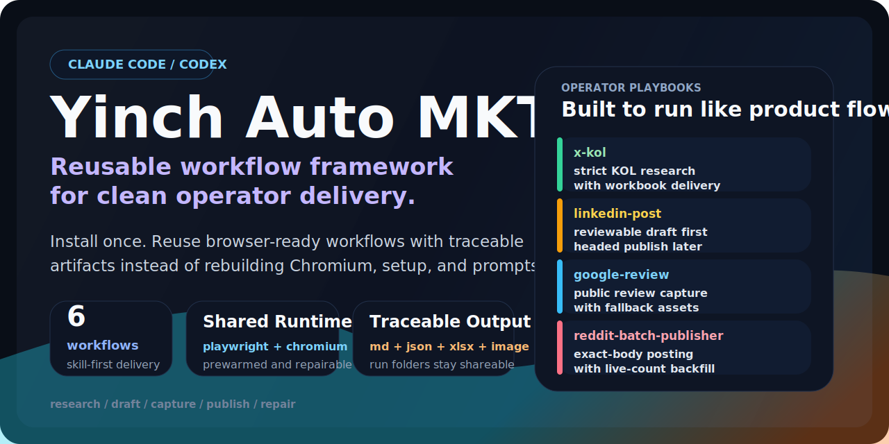

<p align="center">
  
</p>

<p align="center">
  <strong>Yincheng's workflow framework for Claude Code and Codex</strong><br />
  Teammates install once, then reuse mature workflows end to end.
</p>

<p align="center">
  <a href="./README.zh.md"></a>
</p>

<p align="center">
  <a href="https://github.com/houyc1217/yinch_auto_mkt/blob/main/LICENSE"></a>
  
  
  
  
</p>

<p align="center">
  <a href="#one-line-install">One-line install</a> ·
  <a href="#what-you-get">What you get</a> ·
  <a href="#architecture">Architecture</a> ·
  <a href="#direct-shell-usage">Direct shell usage</a>
</p>

## One-line install

Copy this sentence into Claude Code or Codex:

```text
Install Yinch Auto MKT from https://raw.githubusercontent.com/houyc1217/yinch_auto_mkt/main/install.sh . Put it into the default global directories for the current agent and fix the environment automatically: if you are Claude Code, configure ~/.claude/skills and optional ~/.claude/agents; if you are Codex, configure ${CODEX_HOME:-~/.codex}/skills; then run a health check.
```

> [!TIP]
> After setup, the user should be able to just use the agent normally without caring about plugin layout, skill paths, or environment details.

## What you get

| Workflow | What it does | Final output |
| --- | --- | --- |
| `x-kol` | Research X/Twitter KOLs with strict filtering and traceable intermediates | JSON artifacts + XLSX |
| `linkedin-post` | Draft reviewable LinkedIn posts, then publish only after approval in a headed browser | Markdown draft + JSON package |
| `google-review` | Capture a public Google Maps review as a screenshot or fallback review card | Image asset + Markdown/JSON package |
| `channel-setup` | Prepare Telegram and X/Instagram publishing setup without storing secrets in the repo | Setup checklist + env template |
| `agent-install` | Repair or reinstall the complete toolkit integration | Working default installation paths |
| `reddit-ops-dashboard` | Analyze Reddit performance, cluster posting waves, and build a batch-first ops dashboard | HTML dashboard + JSON analysis + email draft |

## Why this repo exists

This is not just a script bundle and not a legacy plugin package.

Its positioning is more specific:

It is **Yincheng's workflow framework** so teammates can reuse mature working patterns through Claude Code or Codex without rebuilding the setup from scratch.

It works as an installation and workflow delivery layer for coding agents:

| Audience | What it solves |
| --- | --- |
| User / teammate | Copy one sentence, then reuse mature workflows |
| Agent | Install capabilities into its own default directories and bridge skills, agents, and runtime setup |
| Workflow | Turn Yincheng's proven methods into traceable, repeatable, and deliverable runs |

## Architecture

The repo is split into three layers.

### 1. Installation layer

- `install.sh`
- `update.sh`
- `scripts/check-env.sh`

This layer solves placement and environment readiness.

### 2. Agent compatibility layer

| Agent | Default mode |
| --- | --- |
| Claude Code | `~/.claude/skills` + optional `~/.claude/agents` |
| Codex | `${CODEX_HOME:-~/.codex}/skills` + repo-level `AGENTS.md` |

The goal is to match the most natural default setup for freshly installed Claude Code and Codex.

This repo now follows a `skill-first` design:

- for Claude Code, `skills` are the primary entrypoint
- `agents` remain as an optional role layer
- `commands` are no longer part of the main architecture

### 3. Business workflow layer

- `x-kol`
- `linkedin-post`
- `google-review`
- `channel-setup`
- `agent-install`
- `reddit-ops-dashboard`

The goal is not to pile more instructions onto the user. The goal is to package repeatable workflows into agent-callable capabilities.

### Runtime self-healing

- create a local venv only when a workflow actually runs
- install Python packages and Playwright on demand
- reuse login only at runtime, never persist credentials into repo files or deliverables

## Default compatibility targets

```text
Claude Code
  ~/.claude/skills
  ~/.claude/agents

Codex
  ${CODEX_HOME:-~/.codex}/skills
  AGENTS.md
```

## What the installer does

1. Clone or update the repo into `~/.yinch-auto-mkt/repo`
2. Verify or install the base prerequisites: `git`, `python3`, `python3 -m venv`
3. Install skills and agents into the default Claude Code and Codex user directories
4. Run `scripts/check-env.sh`

Business runtime dependencies self-heal on first use:

- local runtime venv under the user's current working directory
- Python packages and Playwright browser installed on demand
- runtime login reuse only; no credentials written into repo files or output artifacts

## How to use it after install

After installation, users can rely on natural language directly. Both Claude Code and Codex use the installed `skills` as the primary entrypoint.

## Repo structure

```text
yinch-auto-mkt/
├── AGENTS.md
├── .claude/
│   ├── agents/
├── assets/
│   └── readme-banner.svg
├── skills/
│   ├── agent-install/
│   ├── channel-setup/
│   ├── google-review/
│   ├── linkedin-post/
│   ├── reddit-ops-dashboard/
│   └── x-kol/
├── scripts/
│   ├── check-env.sh
│   ├── install-agent-assets.sh
│   └── install-deps.sh
├── install.sh
└── update.sh
```

## Direct shell usage

```bash
curl -fsSL https://raw.githubusercontent.com/houyc1217/yinch_auto_mkt/main/install.sh | bash
```

Update:

```bash
curl -fsSL https://raw.githubusercontent.com/houyc1217/yinch_auto_mkt/main/update.sh | bash
```

Health check:

```bash
~/.yinch-auto-mkt/repo/scripts/check-env.sh
```

## Notes

> [!IMPORTANT]
> `linkedin-post` always produces a draft first and only publishes after explicit approval.

> [!NOTE]
> `x-kol` only counts `article` and `post`.

> [!NOTE]
> `google-review` prefers public Google Maps review capture and does not require Google login by default.

> [!NOTE]
> `reddit-ops-dashboard` defaults to a 72-hour batch-first view and keeps `Reply Queue` limited to live unresolved threads.

> [!WARNING]
> Credentials, cookies, and tokens are never written into repo files or deliverables. Telegram tokens and social connection details should stay in user-local environment storage or external integrations.

## Changelog

- 2026-03-06: Rebuilt the repo into a skill-first framework for Claude Code and Codex, with installer-driven environment repair and default-path setup.
- 2026-03-06: Added reusable workflows for `x-kol`, `linkedin-post`, `google-review`, `channel-setup`, and `agent-install`.
- 2026-03-06: Standardized traceable outputs, English-first documentation, and safer handling of runtime-only credentials.
- 2026-03-09: Added `reddit-ops-dashboard` for 72-hour Reddit performance review, batch clustering, live-only reply queue management, and reusable HTML dashboard delivery.

More workflow assets and refinements are already in progress.

## License

MIT

---

Yincheng thanks everyone on the team for the help and support, and wishes you all smooth work ahead.
